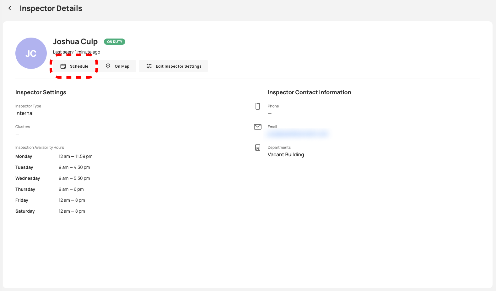
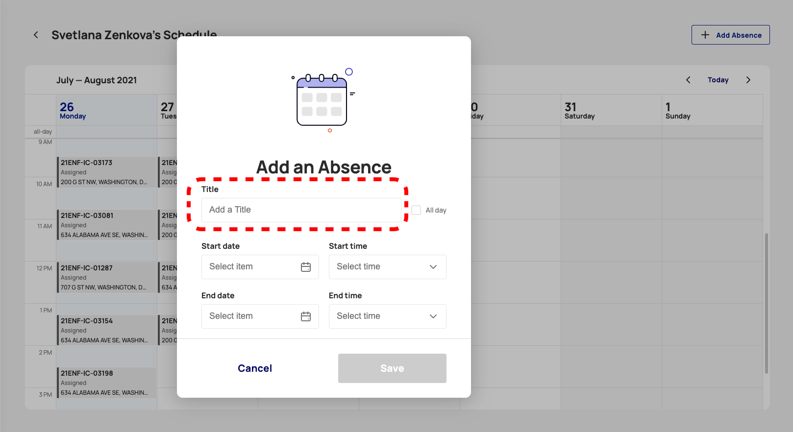
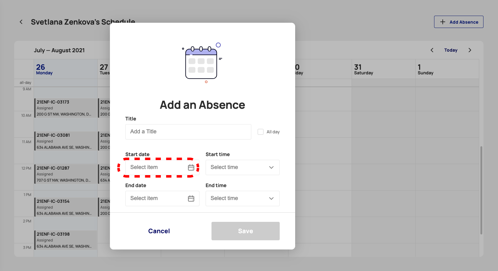
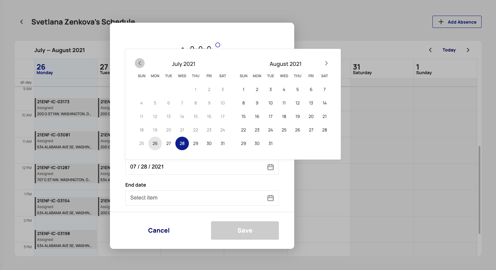
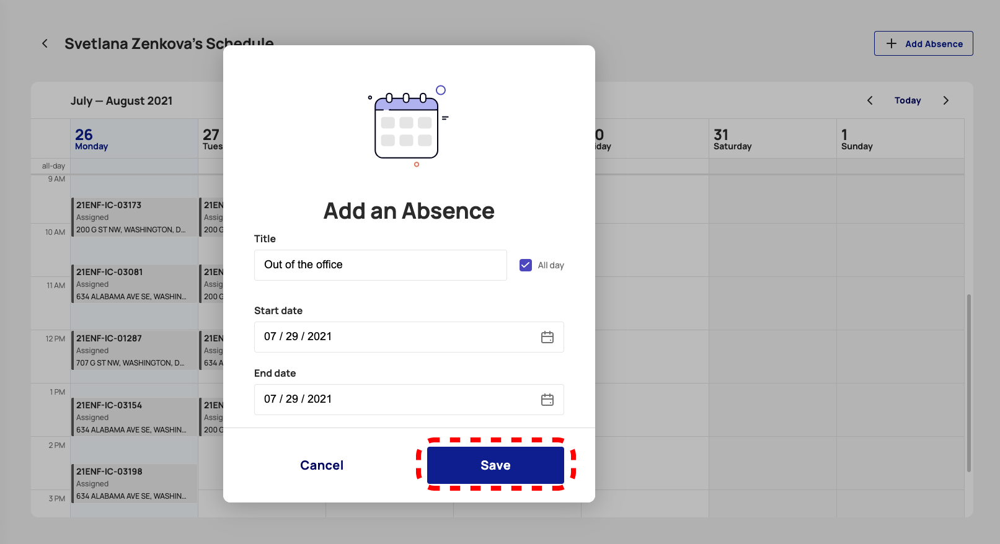
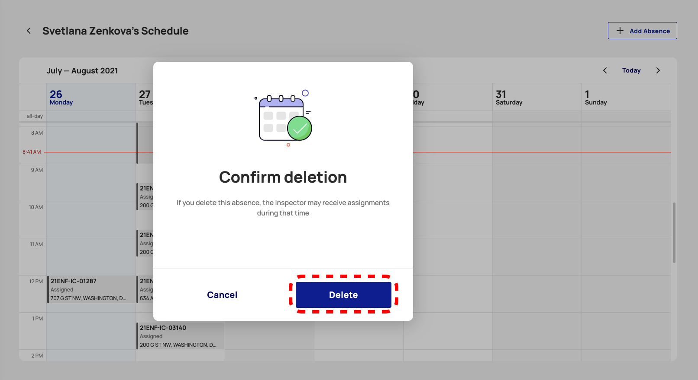

<section id="detailed-inspector-page" markdown="1">

# Detailed Inspector Page 

User's can view detailed information about individual inspectors through the Dispatch Portal.

For information about editing users details please review User Management found here [User Management](https://dcra-dispatch-docs.terraiq.io/docs/dp-user-management.html).

<section id="field-descriptions-updated" markdown="1">

{: data-lightbox="2"}

## Field Descriptions 
The Inspector Details page will display the following information: 

* **Inspector Name** - Displays the inspector's first and last name.
* **Inspector Status** - Displays the inspector's current status
* **Inspector Type** - Displays the inspector's type.
* **Clusters** - Displays the inspector's assigned clusters.
* **Inspection Availability Hours** - Displays the inspector's hours avialable per day.
* **Phone** - Displays the inspector's phone number.
* **Email** - Displays the inspector's email address.
* **Department** - Displays the inspector's department.

## Inspector Actions
The following actions are permitted via the detailed Inspectors page. 

* **Schedule** - Navigates the user to the inspectors schedule.
* **On Map** - Navigates the user to the exact location of the inspector on the dashboard (if the inspector is On Duty and has a Last Seen indicated).
* **Edit Inspectors Settings** - Triggers a modal allowing the user to make updates to the inspectors settings. See [User Management](https://dcra-dispatch-docs.terraiq.io/docs/dp-user-management.html) for more details. 
 
## Inspector Schedules

An inspector's schedule can be accessed 3 different ways.

Via the dashboard by selecting Schedule on the details card for an inspector.

{: data-lightbox="5"}

Via the Inspector's table by selecting the calendar icon.

{: data-lightbox="6"}

Via the Inspector's details page by selecting Schedule.

{: data-lightbox="7"}

Once accessed you will see the current weeks assignments for the inspector and any absences they may have.
Full day absences are listed at the top of the day and partial day absences are listed during the time the absence was applied. The image below outlines an inspectors schedule and full/partial day absences. 

{: data-lightbox="8"}

</section>

<section id="creating-an-absence" markdown="1">

## Creating an Absence

To create an absence select the Add Absence button at the top right of the Inspector's schedule.

{: data-lightbox="9"}

Creating an absence requires that you provide a title.

{: data-lightbox="10"}

By default the system is set up to create partial day absences. To create a partial day absence you will need to select the start date/time and end date/time.

{: data-lightbox="11-group"}

{: data-lightbox="11-group"}

{: data-lightbox="11-group"}

After providing the start date/time and end date/time you can select the Save button. The system will confirm the creation select the Ok button to review your schedule.

{: data-lightbox="12-group"}

{: data-lightbox="12-group"}

To create an all day absence you must select the checkbox for All day.

{: data-lightbox="13"}

All day absences require a title and start/end date.

{: data-lightbox="14-group"}

{: data-lightbox="14-group"}

{: data-lightbox="14-group"}

To delete an absence select the absence that is no longer needed, and select the Delete Absence button on the absence details popover. 

{: data-lightbox="15-group"}

{: data-lightbox="15-group"}

The system will ask you to confirm the deletion action.  If you want to delete the absence select the Delete button, if you no longer wish to delete select the cancel button.

{: data-lightbox="16"}

</section>
</section>
