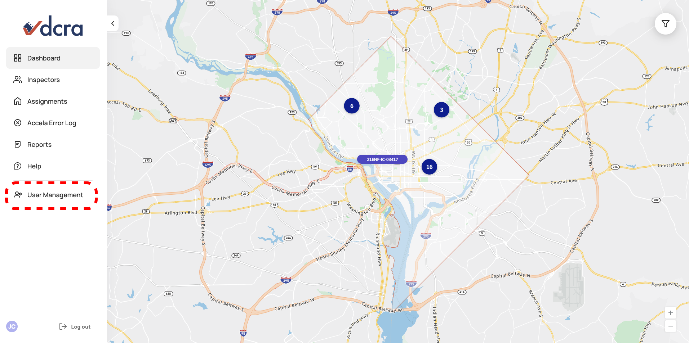
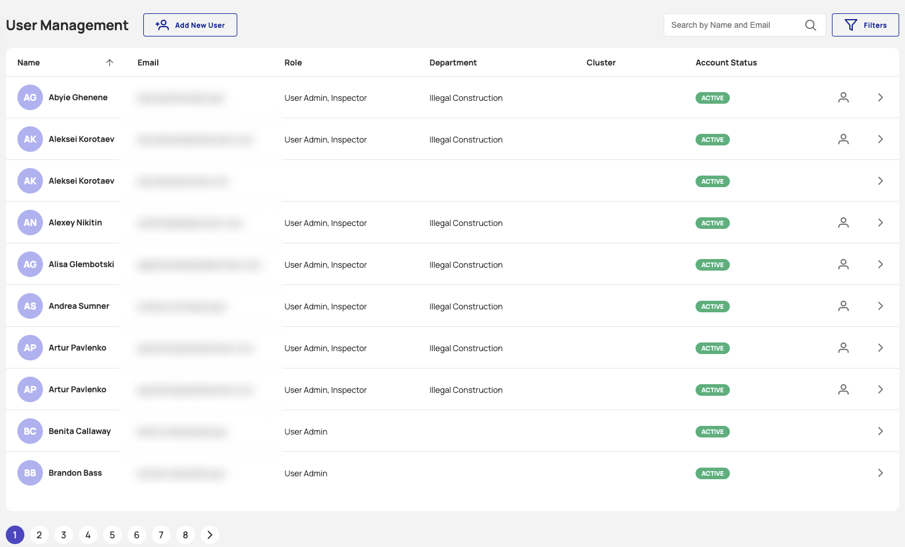
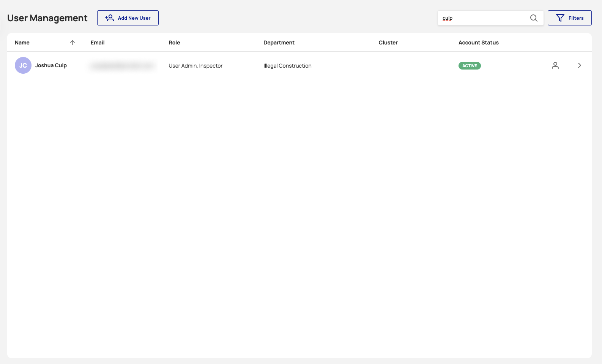
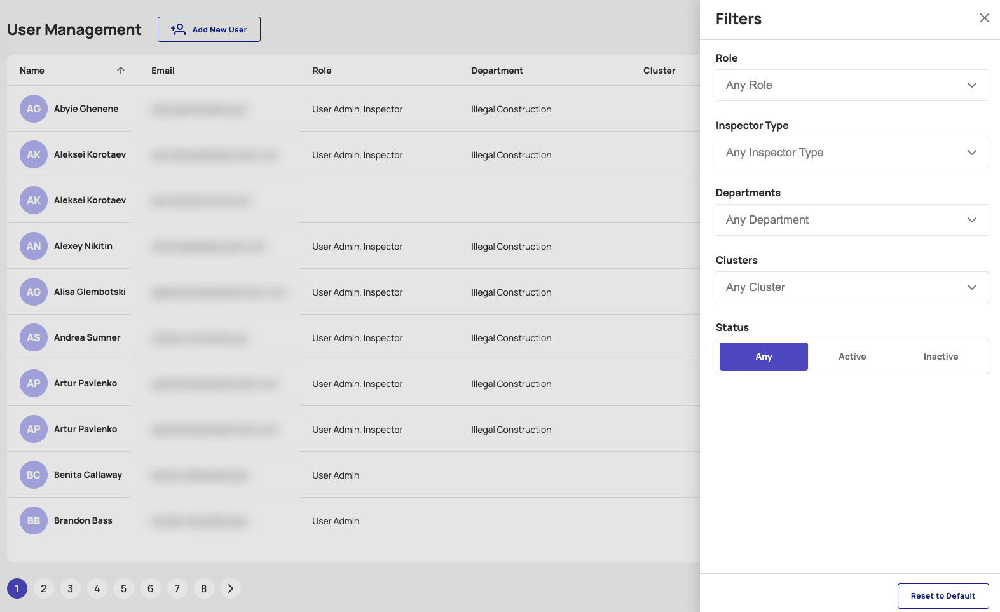
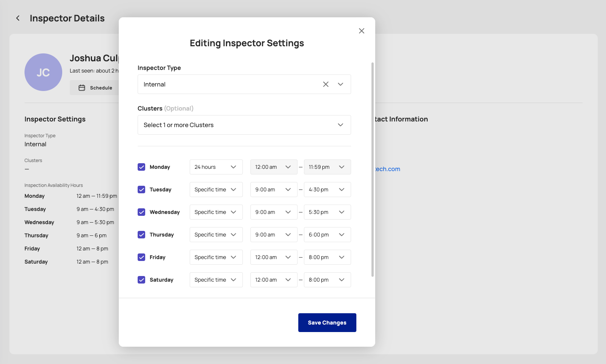

<section id="user-management-page" markdown="1">

# User Management NEW

User Admins and Managers have access to the User Management functionality through the Dispatch Portal.  The User Management feature allows for updates to a users role, permissions, assigned clusters, and inpsectors avialable working hours. User Management is accessed via the main navigation menu (outlined in red below).  

## User Management Page

The User Management page contains all users within the Dispatch system, and acts as the hub to add users, search for users, and update user permissions.

 
### Add New User

User Admins and Managers have the ability to add users to the Dispatch system.  Selecting Add New User triggers a modal window allowing the creation of a new Dispatch user. Creating a new user requires an Access DC Email Address, Name, User Role(s), and Department(s).  Once all required field are satisfied selecting Add User confirms the action. 

Creating a new user triggers an invite email that is sent to the provided email address. 

 
### Search, Filtering, and Sorting 

The User Management page features standard searching (by name or email), filtering (by role, inspector type, department, cluster, or status), and table sorting functionality.

Users can be found by searching via the search bar located in the top right corner of the table.  As users type their search the system features type ahead results and updates results as the search criteria is added. 

Filtering allows the results to be defined by role, inspector type, department, cluster, or status.

The User Management table has standard table sorting by column. 

## User Permission Details

Seleting a user via the User Mangement table navigates to the User Permission Details page. From the User Permission Details page updates can be made to the selected user by selecting the Edit User Permissions button.  The View Inspectors Settings button navigates to the Inspector Details page for the seleted user. 

### Edit User Permissions 

The Editing User Permissions modal allows for updates to the User's Role, Department, and status. All udpates must be saved once updates have been made via the Save Changes button. 

#### User's Role

1. **User Admin** - has access to all features and functionality on the Portal, the only user that has access to User Management functionality.
2. **Manager** - has access to all Portal pages including Reports and can edit Inspector Settings, but no access to User Management functionality.
3. **Portal User** - has access to all Portal pages, except Reports and User Management.
4. **Inspector** - has access to Help page on the Portal and is able to login to the Dispatch app.

#### Department

Department designates what types of inspections can bee assigned to the inspector. 

#### Status

Status designates whether or not the user can access the Dipatch Portal and Dispatch App.  Inactive users cannot access the systems; Active users will be permitted to access the Dispatch Portal and Dispatch App based on their role. 

## Inspector Details

When viewing an Inspector's Details admins and managers can make updates to an inspectors settings by selecting the Edit Inspector Settings button.

### Edit Inspector Settings

Updates can be made to the Inspector's Type, Clusters, and Availability.

#### Inspector Type

Inspector Type designates whether the inspector is Internal or External. 

#### Clusters

Clusters designates the assignment allowed for the Inspector based on preferred clusters.

#### Availability

Inspectors avialability can be adjust by designating what days are available via the checkbox to the left of the day and the hours the user is available via the start and end timeframe dropdowns.  If the inspector has a day they are not avialable the start and end timeframe dropdowns will not be present and the text "No Availability" will be dipslayed. 
